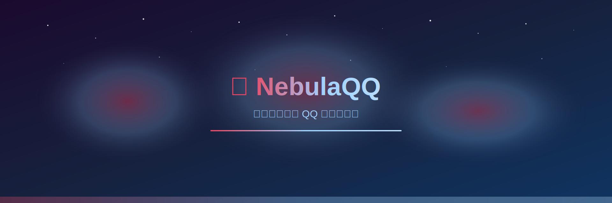
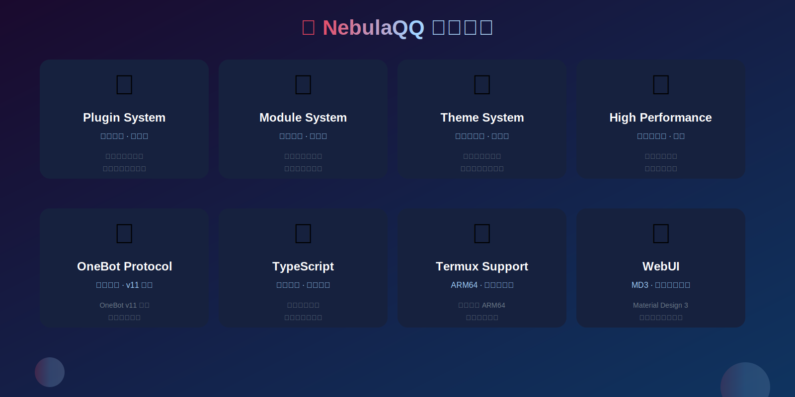
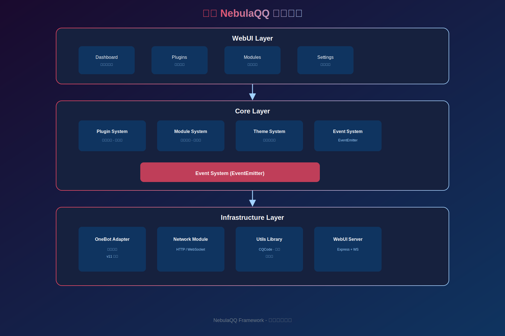

<div align="center">



# 🌌 NebulaQQ

**新一代现代化 QQ 机器人框架 · 重新定义智能交互**

[](LICENSE)
[](https://nodejs.org/)
[](https://www.typescriptlang.org/)
[](https://onebot.dev/)
[](https://nebulaqq.dev)
[](./packages/webui)
[](https://github.com/Starlight-apk/NebulaQQ)

[](https://github.com/Starlight-apk/NebulaQQ/issues)
[](https://github.com/Starlight-apk/NebulaQQ/network)
[](https://github.com/Starlight-apk/NebulaQQ/blob/main/LICENSE)
[](https://github.com/Starlight-apk/NebulaQQ/commits/main)

---

### 🌍 选择语言 / Select Language

[🇨🇳 简体中文](README.md) · [🇺🇸 English](README.en.md) · [🇪🇸 Español](i18n/README.es.md) · [🇷🇺 Русский](i18n/README.ru.md) · [🇯🇵 日本語](i18n/README.ja.md) · [🇰🇷 한국어](i18n/README.ko.md)

---

[🚀 快速开始](#-快速开始) · [📦 核心模块](#-核心模块) · [🌐 WebUI](#-webui) · [📖 文档](#-文档) · [💬 社区](#-社区)

</div>

---

<div align="center">



</div>

## 📑 目录导航

<details open>
<summary><b>点击展开/收起</b></summary>

- [✨ 特性亮点](#-特性亮点)
- [🚀 快速开始](#-快速开始)
  - [方式一：一键安装](#方式一一键安装-推荐)
  - [方式二：手动安装](#方式二手动安装)
  - [方式三：创建新项目](#方式三创建新项目)
- [📦 核心模块](#-核心模块)
- [🌐 WebUI](#-webui)
  - [界面预览](#界面预览)
  - [内置主题](#内置主题)
- [🏗️ 架构设计](#️-架构设计)
- [💡 示例代码](#-示例代码)
- [📱 平台支持](#-平台支持)
- [📖 文档资源](#-文档资源)
- [🤝 参与贡献](#-参与贡献)
- [🙏 致谢](#-致谢)

</details>

---

## ✨ 特性亮点

<div align="center">

| <g-emoji class="g-emoji" alias="🧩">🧩</g-emoji> **插件系统** | <g-emoji class="g-emoji" alias="🔷">🔷</g-emoji> **模块系统** | <g-emoji class="g-emoji" alias="🎨">🎨</g-emoji> **主题系统** |
|:---:|:---:|:---:|
| 依赖管理<br/>热重载 | 按需加载<br/>热插拔 | 自定义主题<br/>个性化 |

| <g-emoji class="g-emoji" alias="⚡">⚡</g-emoji> **高性能** | <g-emoji class="g-emoji" alias="🔌">🔌</g-emoji> **OneBot** | <g-emoji class="g-emoji" alias="📦">📦</g-emoji> **TypeScript** |
|:---:|:---:|:---:|
| 连接池优化<br/>缓存系统 | 完整协议支持<br/>v11 标准 | 完整类型定义<br/>开发体验 |

| <g-emoji class="g-emoji" alias="📱">📱</g-emoji> **Termux** | <g-emoji class="g-emoji" alias="🌐">🌐</g-emoji> **WebUI** | <g-emoji class="g-emoji" alias="🛠️">🛠️</g-emoji> **CLI** |
|:---:|:---:|:---:|
| ARM64 支持<br/>移动端运行 | MD3 设计<br/>明日方舟美学 | 快速创建<br/>一键部署 |

</div>

---

## 🚀 快速开始

### 方式一：一键安装 (推荐)

```bash
# 克隆项目
git clone https://github.com/Starlight-apk/NebulaQQ.git
cd NebulaQQ

# Linux/macOS/Termux
chmod +x install.sh
./install.sh all

# Windows
install.bat
```

### 方式二：手动安装

```bash
# 1. 安装依赖
npm install --legacy-peer-deps

# 2. 构建项目
npm run build

# 3. 运行示例
cd examples/basic
npm install --legacy-peer-deps
npm run dev
```

### 方式三：创建新项目

```bash
# 使用 CLI 工具
npx create-nebulaqq my-bot
cd my-bot
npm install
npm run dev
```

---

## 📦 核心模块

<div align="center">



</div>

| 模块 | 说明 | 状态 | 文档 |
|------|------|:---:|------|
| [`@nebulaqq/core`](./packages/core) | 核心模块 - 事件系统、消息处理 | ✅ | [📖](./packages/core/README.md) |
| [`@nebulaqq/plugin-sdk`](./packages/plugin-sdk) | 插件 SDK - 开发工具包 | 🔄 | [📖](./packages/plugin-sdk/README.md) |
| [`@nebulaqq/module-sdk`](./packages/module-sdk) | 模块 SDK - 热插拔模块 | ✅ | [📖](./packages/module-sdk/README.md) |
| [`@nebulaqq/theme-sdk`](./packages/theme-sdk) | 主题 SDK - 自定义主题 | ✅ | [📖](./packages/theme-sdk/README.md) |
| [`@nebulaqq/adapter-onebot`](./packages/adapter-onebot) | OneBot v11 协议适配器 | ✅ | [📖](./packages/adapter-onebot/README.md) |
| [`@nebulaqq/network`](./packages/network) | 网络模块 - HTTP/WebSocket | ✅ | [📖](./packages/network/README.md) |
| [`@nebulaqq/utils`](./packages/utils) | 工具函数库 - CQ 码/缓存/限流 | ✅ | [📖](./packages/utils/README.md) |
| [`@nebulaqq/webui`](./packages/webui) | WebUI 前端 - Vue 3 + Vite | ✅ | [📖](./packages/webui/README.md) |
| [`@nebulaqq/webui-server`](./packages/webui-server) | WebUI 后端 - Express + WS | ✅ | [📖](./packages/webui-server/README.md) |

---

## 🌐 WebUI

<div align="center">


**NebulaQQ WebUI - Material Design 3 × 明日方舟美学**

</div>

### 界面预览

<div align="center">

| **概览 Dashboard** | **插件管理 Plugins** |
|:---:|:---:|
| 数据可视化 | 插件列表管理 |

| **模块管理 Modules** | **主题设置 Themes** |
|:---:|:---:|
| 模块热插拔 | 多主题切换 |

</div>

### 内置主题

<div align="center">

| 🌑 **明日方舟·暗** | ☀️ **罗德岛·光** | 💎 **源石技艺** |
|:---:|:---:|:---:|
| 深色背景<br/>源石风格 | 明亮简洁<br/>清爽设计 | 渐变特效<br/>发光效果 |

</div>

### 快速启动

```bash
# 开发模式
npm run dev:webui

# 生产构建
npm run build:webui

# 启动服务器
npm run start:webui

# 访问 http://localhost:8080
```

---

## 🏗️ 架构设计

```
┌─────────────────────────────────────────────────────────────────┐
│                        NebulaQQ Framework                        │
├─────────────────────────────────────────────────────────────────┤
│                                                                  │
│  ┌──────────────────────────────────────────────────────────┐   │
│  │                    WebUI Layer                            │   │
│  │  ┌─────────────┐ ┌─────────────┐ ┌─────────────┐         │   │
│  │  │  Dashboard  │ │   Plugins   │ │   Settings  │         │   │
│  │  └─────────────┘ └─────────────┘ └─────────────┘         │   │
│  └──────────────────────────────────────────────────────────┘   │
│                                                                  │
│  ┌──────────────────────────────────────────────────────────┐   │
│  │                    Core Layer                             │   │
│  │  ┌─────────────┐ ┌─────────────┐ ┌─────────────┐         │   │
│  │  │   Plugin    │ │   Module    │ │   Theme     │         │   │
│  │  │   System    │ │   System    │ │   System    │         │   │
│  │  └─────────────┘ └─────────────┘ └─────────────┘         │   │
│  │  ┌─────────────────────────────────────────────┐         │   │
│  │  │         Event System (EventEmitter)          │         │   │
│  │  └─────────────────────────────────────────────┘         │   │
│  └──────────────────────────────────────────────────────────┘   │
│                                                                  │
│  ┌──────────────────────────────────────────────────────────┐   │
│  │                  Infrastructure Layer                     │   │
│  │  ┌─────────────┐ ┌─────────────┐ ┌─────────────┐         │   │
│  │  │   OneBot    │ │   Network   │ │    Utils    │         │   │
│  │  │   Adapter   │ │   Module    │ │   Library   │         │   │
│  │  └─────────────┘ └─────────────┘ └─────────────┘         │   │
│  └──────────────────────────────────────────────────────────┘   │
│                                                                  │
└─────────────────────────────────────────────────────────────────┘
```

---

## 💡 示例代码

### 基础机器人

```typescript
import { NebulaBot, definePlugin } from '@nebulaqq/core';

// 定义插件
const helloPlugin = definePlugin({
  manifest: {
    name: 'hello',
    version: '1.0.0',
    description: '问候插件'
  },

  async onMessage(ctx) {
    if (ctx.message === 'hello') {
      await ctx.reply('你好！欢迎使用 NebulaQQ! 🌌');
    }
  }
});

// 创建机器人
const bot = new NebulaBot({
  logging: { level: 'info', colors: true },
  adapter: {
    type: 'websocket',
    host: '127.0.0.1',
    port: 3000
  },
  plugins: [helloPlugin]
});

// 启动
await bot.start();
```

### 高级功能

```typescript
import { Cache, RateLimiter, CQ } from '@nebulaqq/utils';

// 缓存系统
const cache = new Cache({ maxSize: 1000, defaultTtl: 3600000 });
await cache.set('key', 'value');

// 限流器
const limiter = new RateLimiter({ capacity: 10, refillRate: 1 });
await limiter.acquire();

// CQ 码
await ctx.reply([CQ.at(userId), CQ.face(123), ' 你好！']);
```

---

## 📱 平台支持

<div align="center">

| <g-emoji class="g-emoji" alias="🐧">🐧</g-emoji> **Linux** | <g-emoji class="g-emoji" alias="🍎">🍎</g-emoji> **macOS** | <g-emoji class="g-emoji" alias="🪟">🪟</g-emoji> **Windows** | <g-emoji class="g-emoji" alias="📱">📱</g-emoji> **Termux** |
|:---:|:---:|:---:|:---:|
| x64 / ARM64 | Intel / M1 | x64 / ARM64 | Android ARM |

</div>

---

## 📖 文档资源

<div align="center">
<table>
<tr>
<td align="center">

[🚀 快速开始](./docs/getting-started.md)

5 分钟上手

</td>
<td align="center">

[🧩 插件开发](./docs/plugins.md)

开发指南

</td>
<td align="center">

[📚 API 参考](./docs/api.md)

完整文档

</td>
<td align="center">

[📱 Termux](./TERMUX.md)

ARM64 部署

</td>
</tr>
<tr>
<td align="center">

[🏗️ 框架结构](./FRAMEWORK.md)

架构详解

</td>
<td align="center">

[🌐 WebUI](./packages/webui/README.md)

UI 文档

</td>
<td align="center">

[📦 安装指南](./INSTALL.md)

一键安装

</td>
<td align="center">

[⭐ 完成总结](./COMPLETION.md)

项目总结

</td>
</tr>
</table>
</div>

---

## 🤝 参与贡献

我们欢迎各种形式的贡献！

1. ⭐ **Fork** 本仓库
2. 🌿 创建特性分支 `git checkout -b feature/AmazingFeature`
3. 💾 提交更改 `git commit -m 'Add some AmazingFeature'`
4. 🚀 推送到分支 `git push origin feature/AmazingFeature`
5. 🔄 开启 **Pull Request**

### 贡献者墙

<div align="center">

[](https://github.com/Starlight-apk/NebulaQQ/graphs/contributors)

</div>

---

## 📊 项目统计

| 指标 | 数值 |
|------|------|
| 📦 核心模块 | 9 个 |
| 🧩 内置插件 | 3 个 |
| 🎨 内置主题 | 3 个 |
| 📄 代码行数 | 10,000+ |
| 📝 文档页面 | 10+ |
| 🌟 GitHub Stars | [](https://github.com/Starlight-apk/NebulaQQ) |

---

## 🙏 致谢

NebulaQQ 基于以下优秀项目构建：

- [NapCatQQ](https://github.com/NapNeko/NapCatQQ) - 灵感来源
- [NapCatReforged](https://github.com/NapNeko/NapCatReforged) - 模块化设计
- [OneBot](https://onebot.dev/) - 协议标准
- [Material Design](https://m3.material.io/) - 设计规范
- [明日方舟](https://ak.hypergryph.com/) - 美学灵感

---

## 👥 贡献者

<div align="center">

| 贡献者 | 角色 | 贡献内容 |
|:---:|:---:|---|
| **[qwencoder](https://github.com/qwencoder)** | 🏆 主贡献者 | 全部代码编写、核心架构设计、功能实现 |
| **[Starlight-apk](https://github.com/Starlight-apk)** | 👑 仓库所有者 | 项目发起、仓库管理、方向规划 |
| **[xuanbao-yujian](https://github.com/xuanbao-yujian)** | 🤝 合作伙伴 | 协作开发、技术支持 |

</div>

---

<div align="center">

### 🌌 NebulaQQ Framework

**重新定义 QQ 机器人开发体验**

[GitHub](https://github.com/Starlight-apk/NebulaQQ) · [文档](#-文档资源) · [示例](#-示例代码) · [讨论区](https://github.com/Starlight-apk/NebulaQQ/discussions)

---

**Made with ❤️ by Starlight-apk Team**

[](LICENSE)
[](https://github.com/Starlight-apk/NebulaQQ)

⭐ 如果这个项目对你有帮助，请给我们一个 Star!

🌌 星云 QQ 机器人框架 - 支持 Linux | macOS | Windows | ARM64 | Termux

</div>
